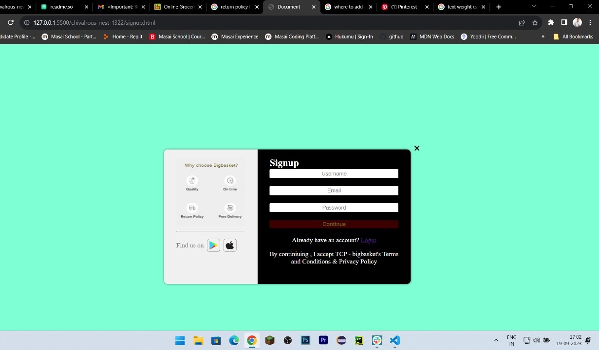

# Bigbasket cloning

Using HTML, CSS & JavaScript this cloning of bigbasket is made, tried to add some different look for the website from the original one.

# Acknowledgements

We would like to express our gratitude to the following individuals and resources for their valuable contributions to the development of [BigBasket Clone Website]:

### Chivalrous-Nest (Team)
 We extend our heartfelt thanks to our whole team of developers, for their dedication, expertise, and tireless efforts in bringing this project to live.

### Open-Source Communities
 We are deeply appreciative of the open-source communities and developers whose contributions provided essential libraries, frameworks, and tools that made this project possible.

### BigBasket
We acknowledge and respect the pioneering work of BigBasket, which served as the inspiration for this project. Our website is a clone developed for educational purposes and is not affiliated with or endorsed by BigBasket.

### Online Learning Resources
We are indebted to the online learning platforms, tutorials, and documentation that helped us acquire the skills necessary to build this website.

### ChatGPT
The ChatGPT tool has been an invaluable resource for troubleshooting and problem-solving. Many thanks to ChatGPT

### Icons and Images
We have used the icons from this website . 

-[awesome fonts](https://www.google.com/search?q=font+awesome+icons&oq=font&aqs=chrome.0.69i59j69i57j0i131i433i512j69i60l2j0i131i433i512j69i60l2j0i131i433i512l2.1688j0j7&client=ms-android-xiaomi-rvo2&sourceid=chrome-mobile&ie=UTF-8) 

### Friends and Family
Last but not least, we'd like to express our appreciation to our friends and family for their unwavering support and encouragement throughout this journey.

## Documentation

Media queries (@media) are used to specify different styles for different screen sizes, making the page responsive.

JavaScript from the Font Awesome library may be used to display icons, although specific usage is not visible in this snippet.

The page appears to have navigation elements, search functionality, product listings, and more.
## Logo

# Home Page
.png>)

# Product Page

.png>)

# Login/ Signup Page

# Cart Page

.png>)

# Product Page

.png>)

# Deployment Link
[Bigbasket_clone](https://timely-haupia-9e0346.netlify.app/)

